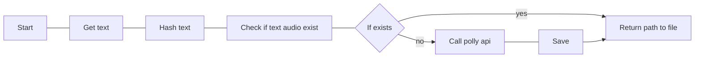

# Text to Speech using AWS Polly 
This project is meant to be an assistant to people (like me) with reading disorders. 

It uses AWS Polly api for neural (only supported in some regions).  



```
usage: main.py [-h] [-t TEXT] [-p PROFILE]

Text to speech, feed in text get audio file out

options:
  -h, --help            show this help message and exit

Mode:
  -t TEXT, --text TEXT  The value to be processed.
  -p PROFILE, --profile PROFILE
                        profile name in your ~/.aws/credentials. the default value is 'default'
```

## Use cases
Read from clip board
```
xclip -selection clipboard -o | ./tty-polly | xargs cvlc --play-and-exit
```

Read from text file 
```
cat file | ./tty-polly | xargs cvlc --play-and-exit
```

user args 
```
./tty-polly -t "some text file" | xargs cvlc --play-and-exit
```

All data is stored in  

```
$HOME/.local/share/tty-polly
```


## Setup 

1. Setup your aws credentials, don't forget to include region. [ref](https://docs.aws.amazon.com/cli/latest/userguide/cli-configure-quickstart.html)
2. install `./requirements.txt` 

```
    pip install -r ./requirements.txt
```

> TODO: create AUR PKGBUILD