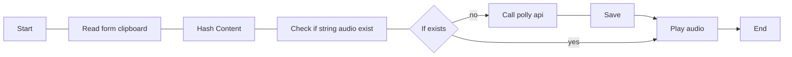
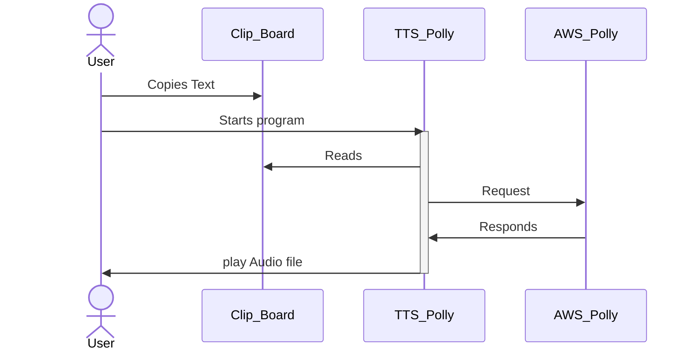

# Text to Speech using AWS Polly 
This project is met to be an assistant to people (like me) with reading disorders. 

## My goals
The program need to be fast and assessable, I'm planing to use the clipboard.

